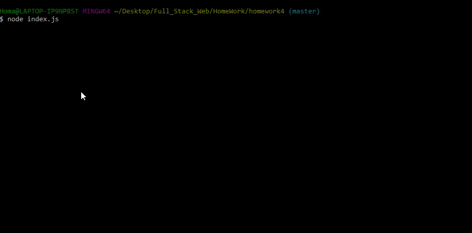
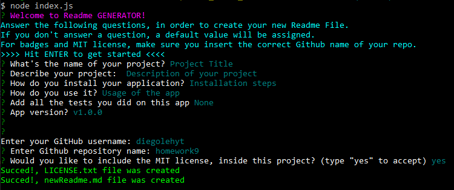
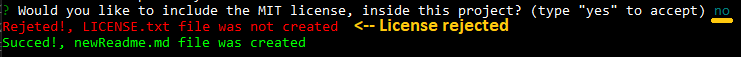
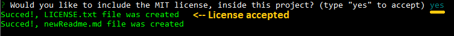
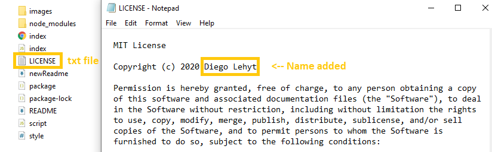

# Readme Generator 🏅     
Homework - 9



- newReadme.md file was created.


## 📌Table of Content

* [Description](#description)
* [Installation](#installation)
* [Usage](#usage)
* [Test](#test)
* [Contributing](#contributing)
* [Usage](#usage)
* [License](#license)
* [Details](#details)
* [Features](#features)
* [URL](#url)
* [Questions](#questions)

## 📋Description
"Readme Generator" is an app that will help you to create good readme me files for your Github repositories. This app will run in the command line powered by JavaScript, using npm plus the data from the API "Github".
```
AS A developer

I WANT a README generator

SO THAT I can easily put together a good README for a new project
```
- Open the app using "command line", (recomended: GitBash).




## 💿Installation
### Prerequisites
  1. Install node.js  
  2. Clone the repository
  3. copy index.js and package.json into your repo
  4. Install NPM packages through command-line
 ```
 npm install 
 ```  
  5. Install contributing NPM (optional)
 ```
 <!-- Contributing -->
 npm install -g covgen
 covgen <your_email_address> 
 ```    
  6. Run index.js in the current directory using gitBash.
 ```
 node index.js
 ```


## ▶️Usage
Answer all the prompt Questions (or you will get the Default value), plus your Github "user" and "repository" that you want the readme for. 

## 📊Test
 ```
 npm run test (for Travis CI).
 ```

## 🤝Contributing [](code_of_conduct.md)
Feel free to pull request and give me your suggestions if any. This project is under the Contributor Covenant.
          
## ⚖️License 
This project is under the MIT License.


## 📑Details

This repository content the html files: index "main page", the CSS styles "style.css", the JavaScript "script.js", mit license"LICENSE.txt", "package.json" and an "image" folder with the captures for this Readme File.

## 📀Features
If you would like to have the MIT License, this Generator also let you include the LICENSE.txt with your name and date on it.




Unique project "version" badge
<<<  >>>

## 🔗URL 

The URL to open the repo page on your Browser is "https://diegolehyt.github.io/homework9/"

## 👤Questions  
 


✉️ E-mail: diegolehy00@gmail.com

